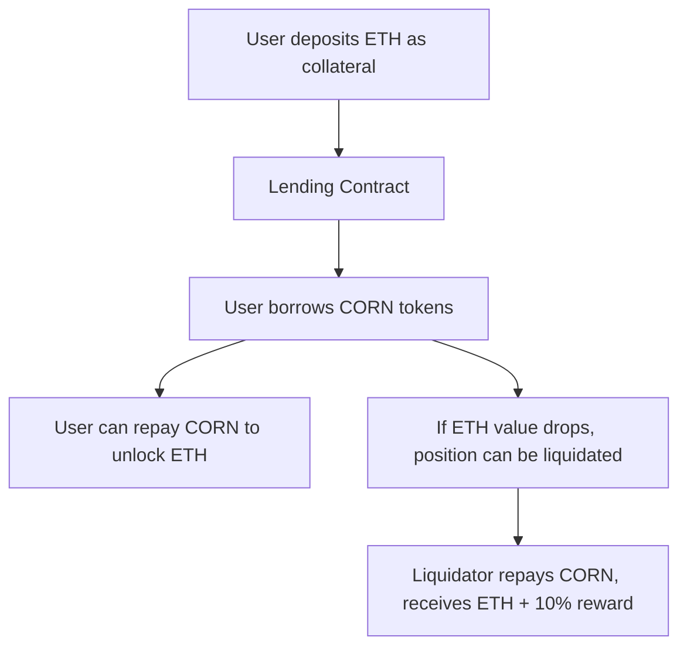

# 💳🌽 Over-Collateralized Lending Platform


## What is This Project?

This is a decentralized lending and borrowing platform built on Ethereum. It lets you:

- **Deposit ETH as collateral**
- **Borrow CORN tokens against your ETH**
- **Repay your loan to unlock your collateral**
- **Liquidate risky positions for a reward**

All lending is **over-collateralized**: you can never borrow more than your collateral is worth. This keeps the system safe and prevents bad debt.

---

## Why Over-Collateralized Lending?

Traditional banks lend money because they can identify you and take legal action if you don't pay back. On the blockchain, we don't have reliable identity or courts, so we require borrowers to lock up more value than they borrow.

**Use cases:**
- **Keep your ETH exposure:** Need cash but don't want to sell your ETH? Borrow against it!
- **Leverage:** Borrow CORN, swap for more ETH, and repeat to increase your exposure (be careful!).
- **Tax efficiency:** In some places, loans aren't taxed like sales.

---

## How Does It Work? (Visual Overview)



- **Collateralization Ratio:** You must always have at least 120% of your loan value in ETH.
- **Liquidation:** If your collateral drops below this, anyone can repay your loan and claim your ETH (plus a 10% bonus).

---

## Key Features

- **Add/Withdraw Collateral:** Deposit or withdraw ETH at any time (as long as your position stays safe).
- **Borrow/Repay:** Borrow CORN tokens, repay to reduce your debt.
- **Liquidation:** Risky positions can be closed by others for a reward.
- **Flash Loans (Advanced):** Borrow CORN with no collateral, as long as you repay in the same transaction.
- **Leverage (Advanced):** Automatically loop borrow/swap/deposit to maximize your position.

---

## How to Use

### 1. **Setup**

- Install [Node.js (v18+)](https://nodejs.org/en/download/)
- Install [Yarn](https://classic.yarnpkg.com/en/docs/install/)
- Clone this repo and install dependencies:
  ```sh
  git clone <your-repo-url>
  cd challenge-over-collateralized-lending
  yarn install
  ```

### 2. **Start the App Locally**

- Start the local blockchain:
  ```sh
  yarn chain
  ```
- Deploy contracts:
  ```sh
  yarn deploy
  ```
- Start the frontend:
  ```sh
  yarn start
  ```
- Open [http://localhost:3000](http://localhost:3000) (or [http://localhost:3001](http://localhost:3001) if port 3000 is busy).

### 3. **Interact with the App**

- **Faucet:** Get free ETH for testing.
- **Deposit ETH:** Add collateral to your account.
- **Borrow CORN:** Borrow up to 83% of your collateral value (to stay above 120% ratio).
- **Repay CORN:** Pay back your loan to unlock your ETH.
- **Withdraw ETH:** Take out collateral if your position is safe.
- **Liquidate:** If someone's position is risky, repay their loan and claim their ETH + 10%!

---

## Visuals

### Dashboard Example


### Collateral/Debt Ratio Over Time


---

## Smart Contracts

- **Lending.sol:** Main contract for collateral, borrowing, and liquidation.
- **Corn.sol:** ERC20 token you borrow.
- **CornDEX.sol:** Decentralized exchange used as a price oracle.
- **MovePrice.sol:** Used to simulate price changes for testing.
- **FlashLoanLiquidator.sol:** (Advanced) Contract for flash loan liquidations.
- **Leverage.sol:** (Advanced) Contract for automated leverage loops.

---

## Advanced Features

### Flash Loans

- Instantly borrow any amount of CORN, as long as you repay in the same transaction.
- Used for advanced strategies like liquidations without holding CORN.

### Leverage

- Automatically loop: deposit ETH → borrow CORN → swap for more ETH → deposit again.
- Maximizes your exposure (but increases risk!).

---

## Safety & Risks

- **Always keep your collateralization ratio above 120%!**
- If the price of ETH drops, you could be liquidated and lose your ETH (but keep the borrowed CORN).
- Leverage increases both potential gains and risks.

---

## License

MIT

---

## FAQ

**Q: What happens if I get liquidated?**  
A: Your ETH collateral is used to repay your loan (plus a 10% bonus to the liquidator). You keep the CORN you borrowed.

**Q: Can I lose more than my collateral?**  
A: No, you can only lose the ETH you deposited.

**Q: Is this safe for real money?**  
A: This is a learning project! Use testnets and never risk real funds.

---

## For Developers

- Contracts are in `packages/hardhat/contracts/`
- Frontend is in `packages/nextjs/`
- Deployment scripts in `packages/hardhat/deploy/`
- Tests in `packages/hardhat/test/`